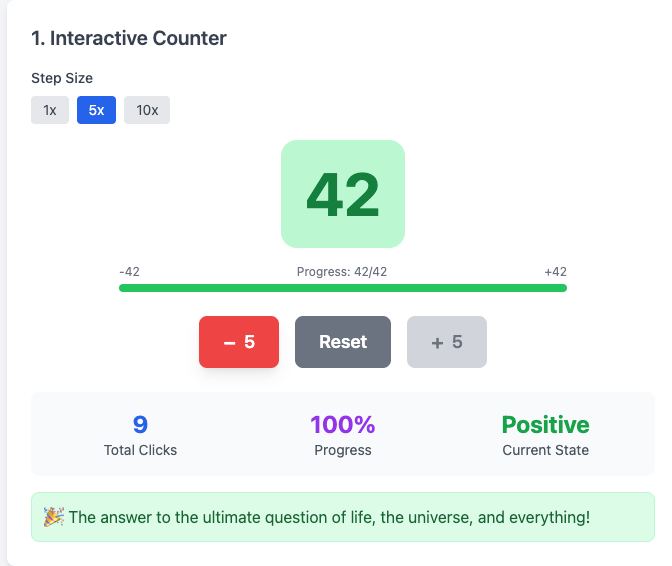

# Stimulus Reactive UI

A reactive UI system built on top of Stimulus.js that enables declarative, state-driven interfaces with minimal JavaScript. This project demonstrates how to create dynamic, interactive web applications using reactive patterns within the Stimulus framework.

## Demo

🚀 **[View Live Demo](https://thomasbrus.github.io/stimulus-reactive-ui/)**



```html
<div data-controller="live">
  <!-- State -->
  <input type="hidden" data-live-property="count" value="0" />

  <!-- Computed properties -->
  <script type="text/template" data-live-property="isPositive">
    state.count > 0
  </script>
  <script type="text/template" data-live-property="statusText">
    state.count < 0 ? 'negative' : 'positive'
  </script>

  <!-- Demo -->
  <h2 live:text="state.count">0</h2>
  <p live:class="{ 'bg-green-100': state.isPositive, 'bg-red-100': !state.isPositive }">
    Counter is <span live:text="state.statusText">positive</span>
  </p>

  <button data-action="click->live#update" data-live-update-param="state.count++">Increment</button>
  <button data-action="click->live#update" data-live-update-param="state.count--">Decrement</button>
</div>
```

The demo is entirely self-contained in a single `index.html` file that showcases 11 different interactive examples. Everything needed to run the demo is included:

- **Tailwind CSS** - Loaded via CDN for styling
- **Stimulus.js** - Imported via ES modules from unpkg
- **LiveController** - Custom Stimulus controller that implements the reactive system
- **Interactive Examples** - 11 demonstrations of reactive UI patterns

## Features

- **Declarative Reactive Bindings** - Use `live:text`, `live:class`, `live:show`, etc. to bind state to DOM elements
- **Computed Properties** - Define derived state using template scripts
- **Two-way Data Binding** - Automatic synchronization between form inputs and state
- **Conditional Rendering** - Show/hide elements based on state
- **Dynamic Styling** - Apply CSS classes and styles reactively
- **State Management** - Clean, predictable state updates with automatic UI synchronization

## Usage

The system centers around a custom `LiveController` that extends Stimulus.js with reactive capabilities:

1. Manages reactive state through JavaScript proxies
2. Processes `live:*` directives in HTML to bind state to DOM elements
3. Automatically updates the UI when state changes
4. Supports computed properties defined in `<script type="text/template">` tags
5. Uses a MutationObserver to detect DOM changes and re-evaluate reactive bindings

### Live Properties

Define reactive state properties that can be bound to form inputs or calculated dynamically.

**Form Input Binding** - Use `data-live-property="propertyName"` on inputs:

```html
<input type="text" data-live-property="username" value="john" />
<input type="checkbox" data-live-property="isActive" />
<select data-live-property="theme">
  <option value="light">Light</option>
  <option value="dark">Dark</option>
</select>
```

**Computed Properties** - Use `<script type="text/template" data-live-property="propertyName">` with JavaScript expressions:

```html
<script type="text/template" data-live-property="fullName">
  state.firstName + ' ' + state.lastName
</script>
<script type="text/template" data-live-property="isValid">
  state.username.length > 3 && state.email.includes('@')
</script>
```

### Live Directives

Bind state to DOM elements using special `live:*` attributes that automatically update when state changes.

| Directive       | Description                   | Example                                     |
| --------------- | ----------------------------- | ------------------------------------------- |
| `live:text`     | Sets element text content     | `live:text="state.count"`                   |
| `live:html`     | Sets element innerHTML        | `live:html="state.content"`                 |
| `live:class`    | Conditionally applies classes | `live:class="{ 'active': state.isActive }"` |
| `live:style`    | Sets CSS styles               | `live:style="{ color: state.textColor }"`   |
| `live:show`     | Shows/hides element           | `live:show="state.isVisible"`               |
| `live:disabled` | Enables/disables element      | `live:disabled="!state.isValid"`            |

**Examples:**

```html
<!-- Text and HTML content -->
<h1 live:text="state.title">Default Title</h1>
<div live:html="state.htmlContent"></div>

<!-- Conditional styling -->
<button
  live:class="{
  'btn-primary': state.isActive,
  'btn-secondary': !state.isActive,
  'disabled': state.isLoading
}"
>
  Submit
</button>

<!-- Dynamic styles -->
<div
  live:style="{
  width: state.progress + '%',
  backgroundColor: state.color
}"
></div>

<!-- Show/hide and enable/disable -->
<div live:show="state.showDetails">Details content</div>
<button live:disabled="!state.isValid">Save</button>
```

**State Updates** - Trigger state changes using the `live#update` action:

```html
<button data-action="click->live#update" data-live-update-param="state.count++">Increment</button>
<button data-action="click->live#update" data-live-update-param="state.isVisible = !state.isVisible">Toggle</button>
```

## Browser Support

This project uses modern JavaScript features including:

- ES6 Modules
- Proxy objects
- MutationObserver
- Template literals

Supported in all modern browsers (Chrome 61+, Firefox 60+, Safari 12+, Edge 79+).
